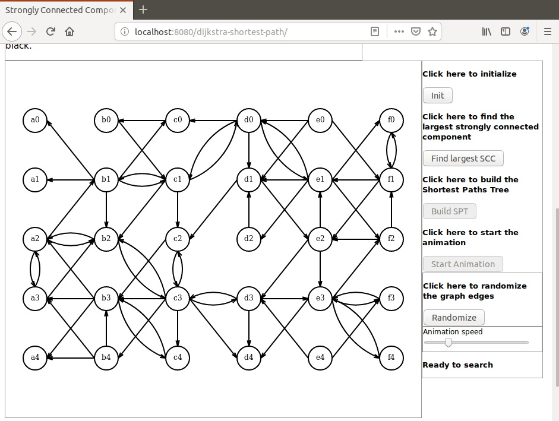
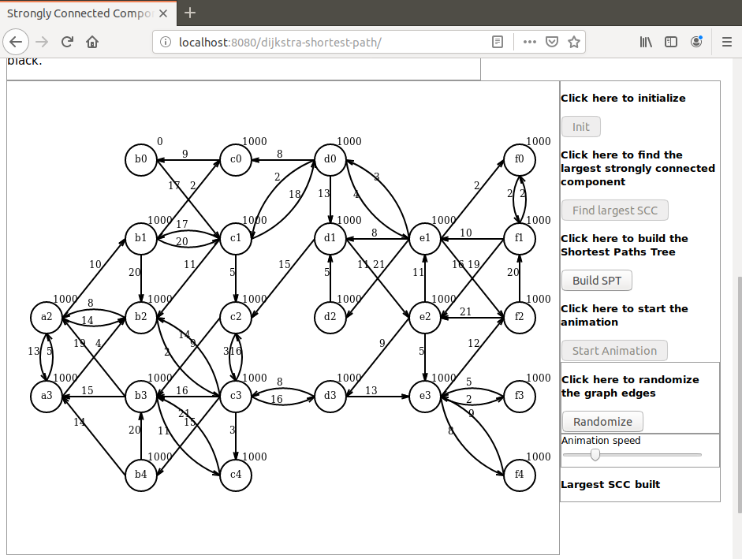
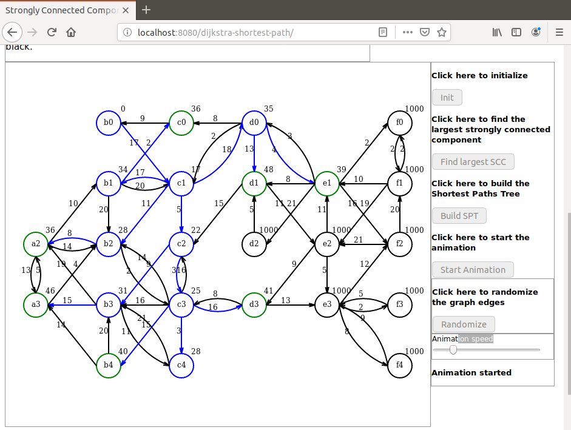
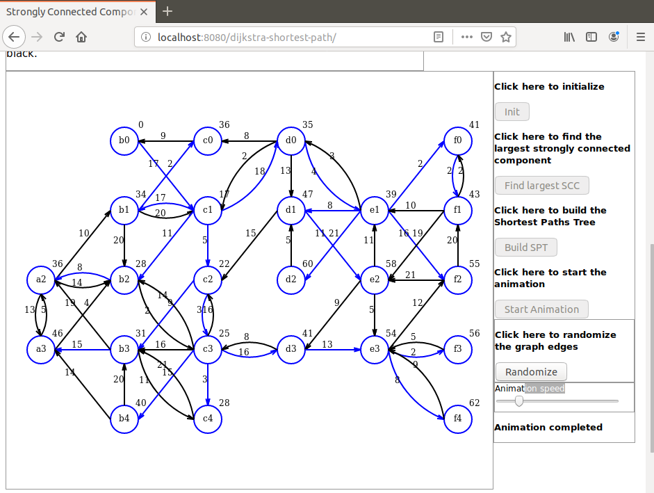

# dijkstra-anim
Java based animated demonstration of Dijkstra algorithm applied to build a Shortest Paths Tree on a strongly connected directed graph

I present here a Java based demonstration of the Dijkstra algorithm that builds a Shortest Paths Tree on a given weighted directed graph.

The graph is strongly connected. This is of course not a requirement for using the Dijkstra algorithm, only a convenience choice that makes the demonstration easier because the source is connected to any vertex by a path.

Following are some implementation details:

A directed graph in randomly initialized in the browser (Javascript).

It is sent to the server as a JSON object.

The server extracts the largest strongly connected component and equips it with a positive weight function. This weighted directed graph is sent back to the browser (Java).

Then the Dijkstra algorithm main loop is executed by the server as a response to an Ajax request from the browser (Java).

All intermediate results are save on server side as a collection that is sent back to the browser and used for animation (Javascript).

At a given step an edge that connects a vertex to its predecessor is drawned blue. Note that the actual predecessor of a given vertex can change from one step to the next.

A newly discovered vertex is drawn green. A finalized vertex is drawned blue.

The distance to the source is displayed for each vertex at each step.

All vertices outside the source are initialized with distance 1000.

# Launching the demo
To launch the demo run the command `mvn spring-boot:run` in project directory. When the application has started open a browser and hit URL `localhost:8080/dijkstra-shortest-path`.

Here are some screen shots that can be seen during the demo:

Initial graph

Largest strongly connected component

Animation step

Animation completed

For a video demo follow this link:

https://youtu.be/8ZsjPdRg_iY 

Dominique Ubersfeld, Cachan, France
